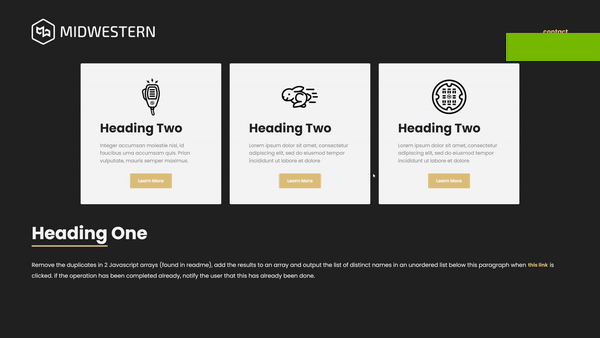

# Fullstack Demo
## Home


## Contact


## Installation

```javascript
// Create a .env with the following in backend-challenge

PORT='PORT NUMBER'

URI='MONGODB URI'

DB_NAME='database where the info is stored'

MIDWESTERN_SEEDED_COLLECTION_NAME='Collection where to store seeded data for lorem paragraphs'

MIDWESTERN_CONTACT_COLLECTION_NAME='Collection where to store POST request data'
// run npm install in both frontend and backend challenge folders

// cd into backend folder

// run the seedData.ts file with npm run seed

// run npm run build to build the transpiled code

// run npm run start to start the backend server

// cd into frontend folder

// run npm run dev to check out the website on port 3000!


```

## Notes: 
Did not run tests on backend besides the post because of jest issues with node and ts, same with frontend for testing with next.

Did not test at screen resolutions above 1080p.

Built with: Next.js, typescript, node, express, mongodb, jest,  and mantine 